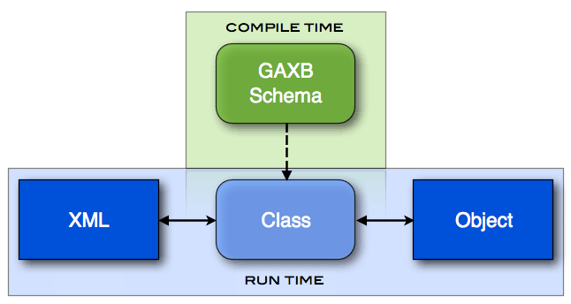

## GAXB

##### What is it?

GAXB (Generic Architecture XML Bindings) is an XML schema-based code generation tool that supports custom cross-platform model data serialization and deserialization.

##### What is it good for?
Rather than writing out all of the classes in your desired language, you can instead build an XML schema. Then, instead of initializing model objects in code, you write XML that conform to that schema. When your project is compiled, GAXB generates the code for your classes and code for the serializer and deserializer needed to convert those objects to XML and vice-versa.

GAXB supports custom lua script templates and is fully serializable, model data can be used to generate XML (serializing) and XML can be used to generate model data (deserializing).



### Schema Example
This schema defines the structure of our Galaxy data model.  This snippet shows the structure that a Planet will conform to. You can view the full schema file [here](galaxy_schema.md).
<pre><code>&lt;!-- Galaxy.xsd --&gt;
&lt;schema xmlns="http://www.w3.org/2001/XMLSchema"
    xmlns:ga="http://schema.smallplanet.com/Galaxy"
    targetNamespace="http://schema.smallplanet.com/Galaxy"&gt;
    
    ... (other element definitions) ...
    
    &lt;!-- Planet --&gt;
    &lt;element name="Planet" type="ga:Planet"/&gt;
    &lt;complexType name="Planet"&gt;
        &lt;complexContent&gt;
            &lt;extension base="ga:AstronomicalObject"&gt;
                &lt;sequence&gt;
                    &lt;element ref="ga:Moon" minOccurs="0" maxOccurs="unbounded" /&gt;
                &lt;/sequence&gt;
                &lt;attribute name="hasRings" type="boolean" default="false" /&gt;
            &lt;/extension&gt;
        &lt;/complexContent&gt;
    &lt;/complexType&gt;

	...
    
&lt;/schema&gt;
</code></pre>

### Generated Base Class Example
This code is the GAXB-generated Galaxy_PlanetBase Objective C header file. This is one of the generated code files that results from compiling an Objective C project with the Galaxy.xsd schema.
<pre><code>// Galaxy_PlanetBase.h
// Autogenerated by gaxb at 00:00:00 AM on 01/01/13

@class Galaxy_Moon;
@interface Galaxy_PlanetBase : Galaxy_AstronomicalObject
{	
    // Attributes
    BOOL hasRings;
    BOOL hasRingsExists;

    // Subelements
    NSMutableArray *Moons;
}

@property (nonatomic) BOOL hasRings;
@property (nonatomic,readonly) BOOL hasRingsExists;
@property (nonatomic,retain) NSMutableArray * Moons;

- (NSString *) hasRingsAsString;
- (void) setHasRingsWithString:(NSString *)string;

@end
</code></pre>

### XML Example
This XML file conforms to the Galaxy.xsd schema and defines a Star System with one Planet that has a Moon. Our very own system, the Solar System, might look like [this](solar_system.md).
<pre><code>&lt;?xml version="1.0" encoding="utf-8" ?&gt;
&lt;StarSystem xmlns="http://schema.smallplanet.com/Planets"&gt;
    
    &lt;Planet name="Planet X" mass="1" hasRings="false"
        &lt;Moon name="Moon Y"/&gt;
    &lt;/Planet&gt;

&lt;/StarSystem
</code></pre>

### Custom Code Example
Empty stub header and implementation files are generated once by GAXB that subclass their base-class.  You may use these classes to write your custom logic.
<pre><code>// Galaxy_Planet.mm
// Autogenerated by gaxb at 00:00:00 AM on 01/01/13
#import "Galaxy_Planet.h"

@implementation Galaxy_Planet

// Write your custom Galaxy_Planet object logic.

@end
</code></pre>

# Installation

Please make sure your system has git, CMake 2.8, libxml2 and a compiler tool-chain available.

- Install git from their <a href="https://help.github.com/articles/set-up-git">setup page</a>.

- Install brew from the <a href="http://mxcl.github.io/homebrew/">Homebrew Page</a> so we can install cmake.

- Install cmake. We recommend the following on Mac OS X:

```bash
brew update
brew install cmake
```

- For cmake, a tool-chain, and libxml2 may we recommend the following on Linux:

```bash
apt-get install build-essential
apt-get install cmake
apt-get install libxml2-dev
```

- Now to get the code:

```bash
git clone -b cmake git://github.com/SmallPlanet/gaxb.git
cd gaxb
git submodule update --init lua
```

- Add build it (out-of-source using cmake)

```bash
mkdir build && cd build
cmake ..
make
```

The executable (gaxb) will be waiting for you in the current directory!

## Usage

If you want to give it a whirl straight away (after building), try the following from the Examples/Sample directory:

```bash
mkdir Generated
../../build/gaxb objc sample.xsd -t ../../templates -o Generated
```

This will generate some quick Objective-C classes in Generated/ based on the schema at sample.xsd.

## Example Project

A sample XCode project for an iOS app using gaxb-generated classes is included in Examples/BigPlanet. Open BigPlanet.xcodeproj from that directory in XCode, select iPhone or iPad Simulator, then Build and Run. This simple example uses the schema located at XMLSchema/Planets.xsd and loads sample data in BigPlanets/sol.xml.  

## License

Copyright (c) 2012 Small Planet Digital, LLC

Permission is hereby granted, free of charge, to any person obtaining a copy of this software and associated documentation files (the "Software"), to deal in the Software without restriction, including without limitation the rights to use, copy, modify, merge, publish, distribute, sublicense, and/or sell copies of the Software, and to permit persons to whom the Software is furnished to do so, subject to the following conditions:

The above copyright notice and this permission notice shall be included in all copies or substantial portions of the Software.

THE SOFTWARE IS PROVIDED "AS IS", WITHOUT WARRANTY OF ANY KIND, EXPRESS OR IMPLIED, INCLUDING BUT NOT LIMITED TO THE WARRANTIES OF MERCHANTABILITY, FITNESS FOR A PARTICULAR PURPOSE AND NONINFRINGEMENT. IN NO EVENT SHALL THE AUTHORS OR COPYRIGHT HOLDERS BE LIABLE FOR ANY CLAIM, DAMAGES OR OTHER LIABILITY, WHETHER IN AN ACTION OF CONTRACT, TORT OR OTHERWISE, ARISING FROM, OUT OF OR IN CONNECTION WITH THE SOFTWARE OR THE USE OR OTHER DEALINGS IN THE SOFTWARE.

## Enjoy!
